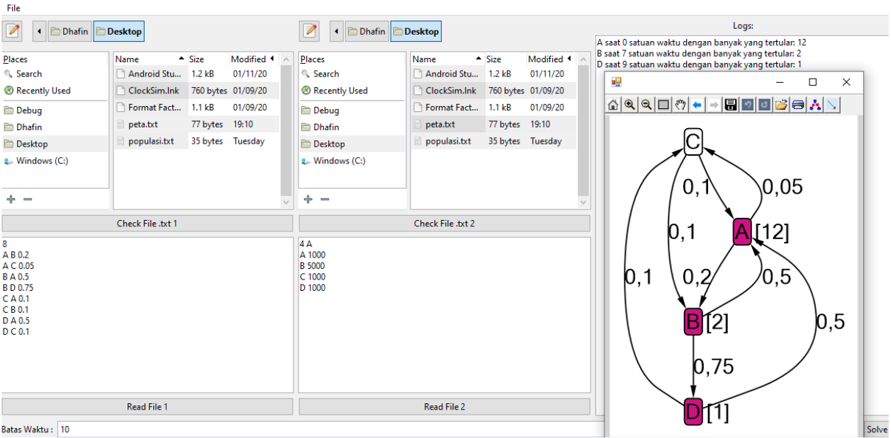

# Stima Two - Viruz

Demonstration of outbreak (virus) with graph visualization in real life with simple computation, logistic function.
## Input
There is 2 input for running this simulation:
- File 1:
- - N is number of edges
- - Next N lines:
- - - Source city, target city, probability of mobility. Split by space.
- File 2:
- - M is number of city, initial city of the outbreak
- - Next M lines:
- - - City, number of population. Split by space.

## Output
Weighted graph (probability) visualization of city infected/not with number of infected. 

## Screenshot
